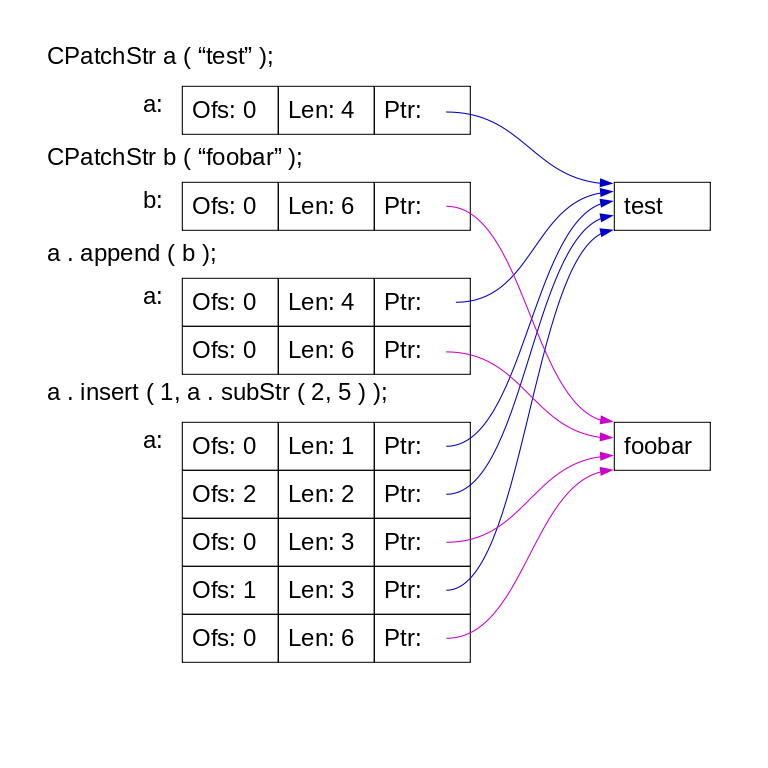

# CPatchStr: Efficient String Manipulation with String Patches in C++

This project implements a class `CPatchStr` that simulates a string composed of multiple parts (substrings or patches). Unlike the standard `std::string`, which stores the entire string as a continuous array of characters, `CPatchStr` records the way the string was constructed from primitive components. This approach optimizes operations like concatenation, insertion, and deletion, especially for long strings, by reducing the need for copying and memory allocation.

## Table of Contents

- [Problem Description](#problem-description)
- [Solution Overview](#solution-overview)
    - [Design of `CPatchStr` Class](#design-of-cpatchstr-class)
    - [Data Structures Used](#data-structures-used)
    - [Key Methods](#key-methods)
- [Implementation Details](#implementation-details)
    - [Append Operation](#append-operation)
    - [Insert Operation](#insert-operation)
    - [Remove Operation](#remove-operation)
    - [SubStr Operation](#substr-operation)
    - [ToStr Operation](#tostr-operation)
- [Usage Examples](#usage-examples)
- [Efficiency Considerations](#efficiency-considerations)
- [Compilation and Testing](#compilation-and-testing)
- [License](#license)

## Problem Description

The task is to implement a class `CPatchStr` in C++ that represents a string built from multiple substrings (patches). The class should:

- Mimic the functionality of `std::string` for operations like concatenation, insertion, deletion, and substring creation.
- Optimize memory usage and performance by avoiding unnecessary copying of characters.
- Record the operations performed and the references to substrings rather than storing the entire string.
- Provide an interface that includes methods like `append`, `insert`, `remove`, `subStr`, and `toStr`.



**Constraints and Notes**:

- The class should support:

    - **Constructors**:
        - Default constructor (creates an empty string).
        - Constructor from a `const char*` (C-style string).
    - **Copy Constructor and Assignment Operator**: Ensuring proper copying of internal structures.
    - **Destructor**: Proper cleanup of allocated resources.
    - **Methods**:
        - `append(const CPatchStr&)`: Appends a string to the end.
        - `insert(size_t pos, const CPatchStr&)`: Inserts a string at the specified position.
        - `remove(size_t from, size_t len)`: Removes a substring starting at `from` with length `len`.
        - `subStr(size_t from, size_t len)`: Creates a substring starting at `from` with length `len`.
        - `toStr()`: Converts the patched string into a continuous C-style string.

- The implementation should not use STL containers like `std::string`, `std::vector`, or `std::list`.
- Efficient memory and time management are crucial, especially for operations on long strings.
- The class should handle exceptions appropriately, throwing `std::out_of_range` when necessary.

## Solution Overview

### Design of `CPatchStr` Class

The `CPatchStr` class represents a string as a linked list of patches (`CPatch` instances). Each `CPatch` holds a portion of the string, and operations on `CPatchStr` manipulate these patches rather than the entire string.

### Data Structures Used

- **`CPatch` Struct**: Represents a patch (substring) with the following members:

    - `shared_ptr<char[]> m_patch`: Shared ownership of the character array representing the substring.
    - `size_t m_size`: The length of the substring.
    - `CPatch* m_next`: Pointer to the next patch in the linked list.

- **`CPatchStr` Class**: Contains:

    - `CPatch* m_head`: Pointer to the first patch in the linked list.
    - `CPatch* m_tail`: Pointer to the last patch in the linked list.
    - `size_t m_size`: Total length of the string represented by the `CPatchStr`.

### Key Methods

- **Constructors**:

    - Default constructor: Initializes an empty string.
    - Constructor from `const char*`: Creates a `CPatchStr` from a C-style string.

- **Copy Constructor and Assignment Operator**:

    - Ensures deep copying of patches and proper reference counting.

- **Destructor**:

    - Cleans up allocated resources, deletes the linked list of patches.

- **String Operations**:

    - `append(const CPatchStr&)`: Adds patches from another `CPatchStr` to the end.
    - `insert(size_t pos, const CPatchStr&)`: Inserts patches at the specified position.
    - `remove(size_t from, size_t len)`: Removes patches or parts of patches starting at `from` for `len` characters.
    - `subStr(size_t from, size_t len)`: Creates a new `CPatchStr` that references the appropriate patches.
    - `toStr()`: Traverses the patches and constructs the full string.

## Implementation Details

### Append Operation

- **Function**: `CPatchStr& append(const CPatchStr& src)`
- **Behavior**:
    - If the source string (`src`) is empty, do nothing.
    - If the current string is empty, copy the source patches directly.
    - Otherwise, adjust the `m_tail` pointer and link the source patches to the end of the current string.
- **Efficiency**: Avoids copying characters; instead, manipulates pointers to patches.

### Insert Operation

- **Function**: `CPatchStr& insert(size_t pos, const CPatchStr& src)`
- **Behavior**:
    - Validates the position; throws `std::out_of_range` if invalid.
    - If inserting at the beginning or end, uses `prepend` or `append`.
    - Otherwise, finds the patch at the insertion point and splits it if necessary.
    - Inserts the source patches between the existing patches.
- **Efficiency**: Minimizes character copying by reusing existing patches and adjusting pointers.

### Remove Operation

- **Function**: `CPatchStr& remove(size_t from, size_t len)`
- **Behavior**:
    - Validates the range; throws `std::out_of_range` if invalid.
    - Traverses patches to find the starting point.
    - Adjusts or removes patches as needed, possibly splitting patches.
    - Updates `m_head`, `m_tail`, and `m_size` accordingly.
- **Efficiency**: Removes only the necessary patches or parts of patches, avoids shifting large amounts of data.

### SubStr Operation

- **Function**: `CPatchStr subStr(size_t from, size_t len) const`
- **Behavior**:
    - Validates the range; throws `std::out_of_range` if invalid.
    - Creates a new `CPatchStr` instance.
    - References the appropriate patches from the original string without copying characters.
    - Handles partial patches by creating new patches for substrings.
- **Efficiency**: Shares existing patches when possible, minimizing data duplication.

### ToStr Operation

- **Function**: `char* toStr() const`
- **Behavior**:
    - Allocates a character array of size `m_size + 1`.
    - Traverses the patches and copies their content into the array.
    - Ensures the string is null-terminated.
- **Efficiency**: Only at this point are all characters copied into a continuous block, necessary for the C-style string.

## Usage Examples

```cpp
#include <iostream>
#include "CPatchStr.h" // Include the header containing CPatchStr class

int main() {
    CPatchStr a("Hello");
    a.append(" World");
    char* result = a.toStr();
    std::cout << result << std::endl; // Output: Hello World
    delete[] result;

    CPatchStr b = a.subStr(6, 5);
    result = b.toStr();
    std::cout << result << std::endl; // Output: World
    delete[] result;

    CPatchStr c("!");
    a.insert(11, c);
    result = a.toStr();
    std::cout << result << std::endl; // Output: Hello World!
    delete[] result;

    a.remove(5, 6);
    result = a.toStr();
    std::cout << result << std::endl; // Output: Hello!
    delete[] result;

    return 0;
}
```

## Efficiency Considerations

- **Memory Usage**: By storing references to substrings (patches) and avoiding unnecessary copying, `CPatchStr` reduces memory consumption, especially when dealing with long strings or frequent modifications.
- **Performance**:
    - **Append and Insert**: Operations are efficient as they manipulate pointers rather than copying entire strings.
    - **Remove**: Efficiently removes patches or adjusts them without shifting large amounts of data.
    - **SubStr**: Creates new strings by referencing existing patches, minimizing data duplication.
- **Lazy Evaluation**: The actual characters are only copied when `toStr()` is called, which constructs the full string. Until then, operations work with references and pointers.
- **Exception Safety**: The class methods handle exceptions appropriately, ensuring the integrity of the data structures even in error conditions.

## Compilation and Testing

Since the implementation avoids using STL containers, ensure your compiler environment supports the necessary C++ features.

### Compilation

```bash
g++ -std=c++17 -o patchstr main.cpp
```

Replace `main.cpp` with the name of your source file containing the `CPatchStr` class and any test code.

### Running Tests

- The provided test code includes assertions to verify the correctness of operations.
- To run the tests, execute the compiled program:

```bash
./patchstr
```

- The program should run without errors if all tests pass.

## License

This project is licensed under the MIT License.

---

Feel free to explore and modify the code to suit your needs. If you have any questions or suggestions, please don't hesitate to contact me.